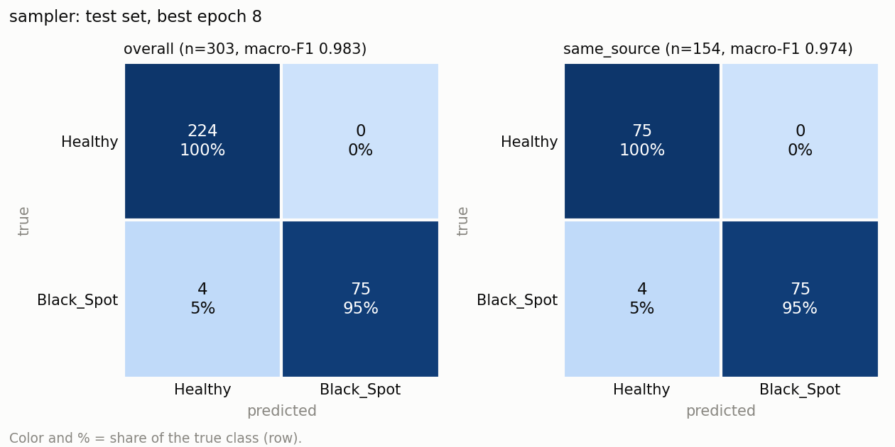
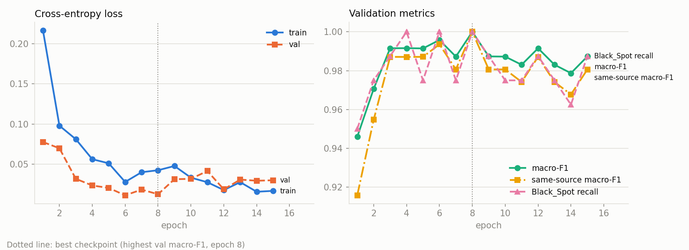
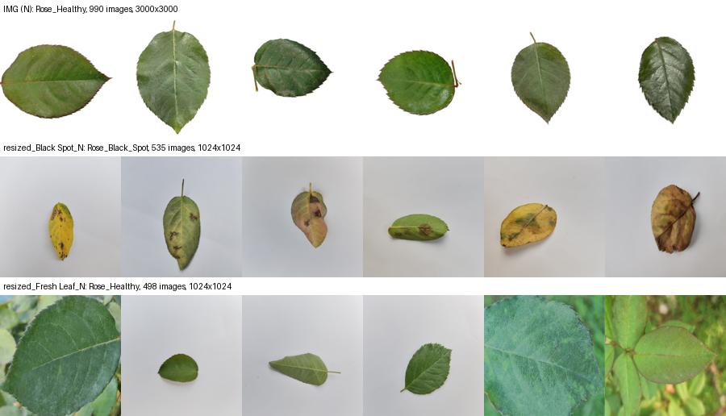
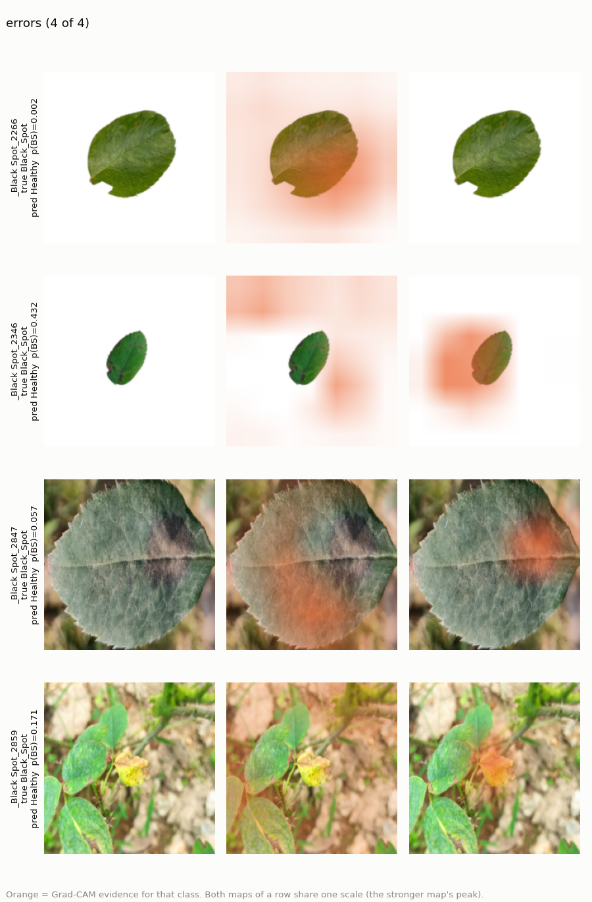

# Rose Disease Classifier: Imbalance, Leakage, Metrics, and Grad-CAM

A binary image classifier (`Rose_Healthy` vs `Rose_Black_Spot`) on an
ImageNet-pretrained ResNet18, trained with a hand-written PyTorch loop.

The classifier is not the point. This project is about four judgment calls
that decide whether a score can be trusted:

1. **Leakage-safe split:** are there copies of the same photo that a random
   split would scatter across train and test?
2. **Class imbalance:** does a 2.8 : 1 imbalance need fixing, and does the
   fix actually help?
3. **Metric choice:** which number tells the truth when one class is rare
   and missing it is costly?
4. **Grad-CAM and shortcut tests:** does the model look at the disease, or
   at a shortcut in how the photos were taken?

Each one was investigated before it was decided, and each finding is
reported as it came out, including the ones that contradicted the plan.

## Why this project

My previous project, [pytorch-food-classifier](https://github.com/turhanGoksu/pytorch-food-classifier),
was about the mechanics: autograd, the training loop, BatchNorm buffers,
checkpointing. This one reuses those mechanics and the same plain-PyTorch
style (no `Trainer`, no Lightning) and focuses on judgment: what can go
wrong between "the model scores 98%" and "the model works".

## Results

Selected model: the `sampler` run (chosen on validation macro-F1 before the
test set was used; see [Class imbalance](#2-class-imbalance)). The test set
(303 images) was evaluated once, with the best checkpoint.

| Test subset | Images | Accuracy | Macro-F1 | Black_Spot precision | Black_Spot recall |
|---|---:|---:|---:|---:|---:|
| **Overall** | 303 | 0.987 | **0.983** | 1.000 | 0.949 |
| **Same-source** (both classes from the same photo sources) | 154 | 0.974 | **0.974** | 1.000 | 0.949 |
| Studio (white-background Healthy only) | 149 | 1.000 | n/a (one class) | – | – |

The model missed 4 of 79 Black_Spot leaves and raised no false alarms.
Validation macro-F1 at the chosen epoch was 1.000. The gap to 0.983 is the
cost of choosing the epoch *on* validation, and the reason a separate test
set exists.





**What these numbers do not say:** the model does not detect black spot
specifically. It calls most *other* rose diseases "Black_Spot" too (see
[Limitations](#limitations)).

Trained on Kaggle (Tesla T4): 15 epochs, batch size 32, AdamW with a
head learning rate of 1e-3 and 1e-4 for the unfrozen `layer4`, seed 42.
The three runs, with full logs, are in the
[Kaggle notebook](https://www.kaggle.com/code/turhangksu/rose-disease-classifier).

## 1. Data audit and a leakage-safe split

Full report: [docs/data_audit.md](docs/data_audit.md).

**The two classes come from three different sources.** Two thirds of the
Healthy images are 3000x3000 studio shots on a pure white background, a
source with no Black_Spot images at all. A model could learn "white
background → Healthy" and look accurate without looking at the leaf.



| Source | Class | Images | Resolution | Background |
|---|---|---:|---|---|
| `IMG (N)` (studio) | Healthy | 990 | 3000x3000 | white cut-out |
| `resized_Fresh Leaf_N` | Healthy | 498 | 1024x1024 | gray paper or field |
| `resized_Black Spot_N` | Black_Spot | 535 | 1024x1024 | gray paper or field |

**There are near-duplicates.** There were no byte-identical files, but 125
pairs of mirrored, cropped, recolored or re-shot copies formed 78 groups.
The obvious tool, dHash, failed here: on single leaves against a white
background it reported unrelated leaves as copies and chained 1,105 images
into one "group". A two-stage check replaced it. Thumbnail correlation
proposes candidates, and ORB keypoints + RANSAC confirm a pair only if many
local details (vein junctions, spot edges) match under one geometric
transform. The threshold was chosen by looking at pairs in each score band.

**The split** ([splits/rose_split.csv](splits/rose_split.csv)) keeps every
group on one side and keeps each source at 70 / 15 / 15 in train / val /
test. The script refuses to write a split in which any group crosses sides.

| Split strategy | Near-duplicate pairs split across sides |
|---|---:|
| Random, stratified by class (as in the previous project), 20 seeds | 49–70 of 125 (mean 60) |
| Group split (used) | 0 of 125 |

The group split removes copy leakage. It does not remove the source
shortcut, because studio images are in every split. That is tested in
section 4.

## 2. Class imbalance

Full report: [docs/imbalance_comparison.md](docs/imbalance_comparison.md).

Three runs, identical except for `--balance`:

- **none:** plain shuffling, about 24 Healthy and 8 Black_Spot per batch.
- **sampler:** `WeightedRandomSampler`. This changes what the model *sees*:
  batches are balanced, but in one epoch the 710 Black_Spot draws covered
  only 322 of the 376 images, and half of the Healthy images were not drawn
  at all.
- **loss:** `CrossEntropyLoss(weight=[0.68, 1.88])`. This changes how much
  each error *counts*: every image is seen once, and Black_Spot errors
  weigh more.

| Run | Val macro-F1 | Test macro-F1 | Test missed Black_Spot | Test false alarms |
|---|---:|---:|---:|---:|
| none | 0.996 | 0.991 | 1 | 1 |
| sampler | **1.000** | 0.983 | 4 | 0 |
| loss | 0.996 | 0.991 | 2 | 0 |

**The differences are noise.** They are 1 to 4 images. Rerunning `none`
with the same seed and code moved its test score by the same amount
(0.987 vs 0.991), from non-deterministic GPU arithmetic alone. McNemar's
exact test finds no significant difference (p ≥ 0.5). At 2.8 : 1, with a
pretrained backbone, the imbalance did not need fixing.

**The selection rule was kept.** `sampler` won on validation, so it is the
reported model, even though it scores lowest on test. Switching to the test
winner would pick the luckiest of three equivalent runs *using the test
set*, and the reported number would be inflated by that choice.

## 3. Metric choice

Implementation: [src/metrics.py](src/metrics.py).

- **Accuracy hides a failing minority class.** On this test set, a model
  that always answers "Healthy" scores 0.739 accuracy and 0.425 macro-F1:
  it finds no disease at all. Macro-F1 gives each class an equal vote, so
  the failure cannot hide behind the 224 Healthy images.
- **Missing a diseased plant costs more than a false alarm**, since the
  fungus spreads. Black_Spot recall is reported next to macro-F1.
- **Black_Spot is fixed as class 1**, not assigned alphabetically, so that
  "recall" from scikit-learn's binary metrics means disease recall rather
  than Healthy recall.
- **Metrics are also reported per source.** "Same-source" (fresh_leaf vs
  black_spot, the same photo conditions for both classes) is the fair
  number. The easy studio images cannot inflate it.
- **The best epoch is chosen by validation macro-F1**, with ties going to
  the lower validation loss. Val and test loss are always unweighted, so
  they mean the same thing in every run.

## 4. Grad-CAM and shortcut tests

Full report: [docs/gradcam_findings.md](docs/gradcam_findings.md).

Grad-CAM is implemented by hand in [src/gradcam.py](src/gradcam.py). A
forward hook on `layer4` keeps the activations, a tensor hook keeps the
gradient of one class logit, and each feature map is weighted by its mean
gradient. It matches the `pytorch-grad-cam` library with a correlation of
1.00000 on 24 maps.

Grad-CAM shows *where* evidence is. To test what the decision *depends on*,
[src/shortcut_tests.py](src/shortcut_tests.py) changes one property of the
input and checks whether predictions change:

| Suspected shortcut | Intervention | Result |
|---|---|---|
| White background → Healthy | White → gray paper tone | **Not used:** 0 of 298 studio predictions flipped, in all 3 runs |
| High resolution → Healthy | 3000px → 1024px + JPEG | **Not used:** 0–1 of 298 flipped |
| Color → Black_Spot | Grayscale | **Partly used:** Black_Spot accuracy 0.98 → 0.69–0.79 |

**Grad-CAM alone would have pointed the wrong way.** On studio images, 60%
of the heatmap mass lies on the white background, which looks like the
feared shortcut. But a 7x7 map cannot follow a leaf outline, and the
background swap flips nothing. Where a heatmap spreads is not the same as
what the decision depends on.



The four errors: one leaf with a single tiny brown dot (most likely a
doubtful label), one leaf that covers a few percent of the frame, one
diffuse gray lesion that the model *did* locate but outweighed with the
rest of the leaf, and one field scene with several leaves.

## Limitations

- **"Black_Spot" means "visible damage", not "black spot disease".** On
  six rose conditions the model never saw, it predicts Black_Spot for 77%
  of powdery mildew, 73% of rust, 67% of downy mildew, 62% of mosaic virus
  and 46% of insect damage. It predicts **Healthy** for 91% of yellow
  mosaic virus. The model only ever saw one disease, so nothing forced it
  to tell diseases apart. For this reason it is not published as a model.
- **Part of the Black_Spot evidence is color** (yellowing, browning).
  Yellowing is a real symptom, but it is not specific to black spot.
- **All test images come from the same collection as the training
  images.** Photos from another phone, another garden or poor lighting
  (distribution shift) will likely score lower, even below the
  same-source number.
- **Labels are not perfect.** At least one "Black_Spot" test image shows
  almost no spot.
- **One run per method.** The imbalance comparison would need several seeds
  per method to rank them reliably.

## Future work

- Train on all eight rose classes (the other six are in the same dataset),
  or on "Black_Spot vs everything else". Either forces the model to
  separate black spot from other damage and from plain yellowing. The new
  classes would need their own audit for sources and duplicates.
- Repeat the imbalance comparison over several seeds and report the mean
  and spread.
- Collect or hold out photos from a different source to measure
  distribution shift directly.

## Project structure

```
├── train.py                  # Entry point: --balance {none, sampler, loss}
├── scripts/
│   ├── audit_data.py         # Sources, compression, backgrounds, near-duplicates
│   ├── make_split.py         # Group-aware, source-stratified split
│   └── compare_runs.py       # Side-by-side table; refuses unfair comparisons
├── src/
│   ├── dataset.py            # Split file -> Dataset/DataLoaders, sampler, class weights
│   ├── model.py              # ResNet18 with a two-logit head
│   ├── engine.py             # Hand-written train/eval loops
│   ├── metrics.py            # Macro-F1, per-class, per-source, confusion matrix
│   ├── checkpoint.py         # Save/load with a fixed class order
│   ├── plotting.py           # Curves and confusion matrices
│   ├── gradcam.py            # Grad-CAM with hooks, figures, library cross-check
│   └── shortcut_tests.py     # Background, resolution, color, unseen diseases
├── splits/rose_split.csv     # The split used by every run (committed)
├── results/                  # Metrics and histories of the Kaggle runs
└── docs/                     # Audit, imbalance and Grad-CAM reports, figures
```

## How to run

Python 3.9+. The dataset is the Rose subset of a plant disease image
collection: point `--data-dir` at the folder that contains `Rose_Healthy`
and `Rose_Black_Spot`.

```bash
python -m venv .venv && source .venv/bin/activate
pip install -r requirements.txt
DATA="path/to/Dataset/Rose"

# 1. Audit and split (the committed split file makes these optional)
python scripts/audit_data.py --data-dir "$DATA"
python scripts/make_split.py --data-dir "$DATA"

# 2. Train the three variants and compare them
for b in none sampler loss; do
    python train.py --data-dir "$DATA" --balance $b
done
python scripts/compare_runs.py --runs-dir outputs

# 3. Grad-CAM and shortcut tests on the selected model
python -m src.gradcam --checkpoint outputs/sampler/best.pt --data-dir "$DATA"
python -m src.shortcut_tests --checkpoint outputs/sampler/best.pt \
    --data-dir "$DATA" --unseen
```

On Kaggle, clone the repo in a GPU notebook with internet access enabled,
set `--data-dir` to the dataset under `/kaggle/input/` and `--output-dir`
to `/kaggle/working/outputs`. Torch, torchvision, scikit-learn and
matplotlib are preinstalled there. Training one variant for 15 epochs took
about 3 minutes on a T4 (all three: 9 min 44 s). On an Apple Silicon Mac
(MPS) an epoch takes about 40 seconds.
