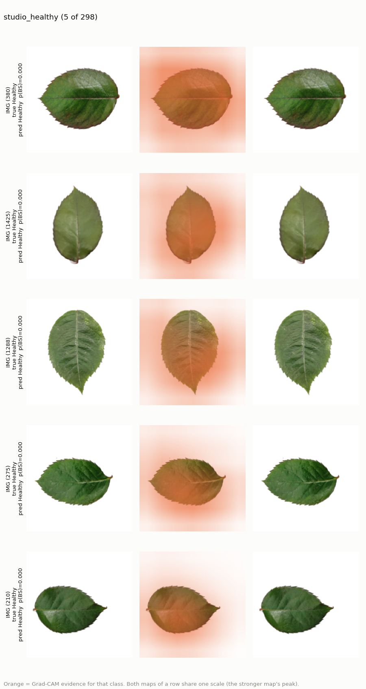
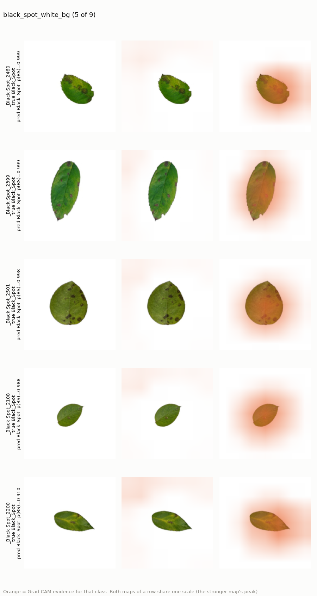
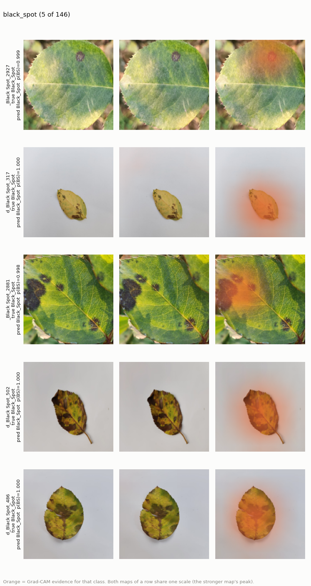

# Grad-CAM and Shortcut Tests: What Does the Model Look At?

The audit ([data_audit.md](data_audit.md)) found three possible shortcuts:

1. **Background:** 97% of white-background images are Healthy.
2. **Resolution:** every 3000x3000 image is Healthy.
3. **Color:** many Black_Spot leaves are yellowed or brown.

Test scores alone cannot rule these out, because the val and test sets
contain the same sources. This document checks them in two ways:

- **Grad-CAM** shows *where* the evidence for a class is.
- **Intervention tests** change one property of the input and check
  whether the prediction changes. If it does not, the model did not rely on
  that property.

Model: the `sampler` run, selected on val (see
[imbalance_comparison.md](imbalance_comparison.md)). Images: val + test
(607). The intervention tests were repeated on the `none` and `loss` runs,
with the same conclusions.

## Implementation

[`src/gradcam.py`](../src/gradcam.py) implements Grad-CAM by hand. A
forward hook on `layer4` keeps the activations `A` ([512, 7, 7]), and a
tensor hook keeps `dScore/dA` during the backward pass from one class
logit. Each map gets the mean of its gradient as its weight, and
`CAM = ReLU(sum_k weight_k * A_k)`, upsampled to 224x224.

It was checked against the `pytorch-grad-cam` library (`--validate-with-library`,
not a project dependency). On 12 images x 2 classes the lowest correlation
between the two maps was **1.00000**.

In the figures, both class maps of an image share **one scale**. Scaling
each map by its own maximum made a class with almost no evidence look as
bright as the predicted class. The first version of the figures had this
problem, and it made faint background blobs look important.

## Findings

### 1. Background: not a shortcut

Replacing the white background with the gray paper tone of the other
sources (RGB 195, 194, 196) changed **none** of the 298 studio Healthy
predictions, in all three runs. After the swap, mean p(Black_Spot) was at
most 0.002.

| Run | Studio Healthy flipped by the background swap |
|---|---:|
| sampler | 0 / 298 |
| none | 0 / 298 |
| loss | 0 / 298 |

Grad-CAM **alone would have suggested the opposite.** For the predicted
class, 60% of the studio images' CAM mass lies on background pixels. A
model looking only at the leaf would reach about 22% at 7x7 resolution,
and a completely uniform map would reach 75%. Two reasons explain the gap.
A 7x7 map is too coarse to follow a leaf outline. And each `layer4` cell
sees a large part of the image, so a "background" cell still contains the
leaf. **Where the heatmap spreads is not the same as what the decision
depends on.** The intervention test answers the second question.

For the 11 Black_Spot images on a white background, the same swap
*lowered* p(Black_Spot) (sampler: 9 of 11 correct → 6 of 11). The swap
leaves a light halo around the leaf edge and a perfectly flat gray, which
real paper photos never have. So this result says more about the edit than
about the model, and with 11 images it is inconclusive. Grad-CAM on these
images puts the Black_Spot evidence on the leaf and its spots:

### 2. Resolution and compression: not a shortcut

Downscaling studio images from 3000px to 1024px and re-encoding them as
JPEG (quality 75), like the `resized_` sources, flipped 0 of 298
predictions (sampler, none) and 1 of 298 (loss).

### 3. Color: partly used for Black_Spot

Removing color (grayscale) hardly affects Healthy, but costs a large share
of the Black_Spot detections:

| Run | Black_Spot accuracy, color → gray | fresh_leaf Healthy | studio Healthy |
|---|---:|---:|---:|
| sampler | 0.975 → 0.792 | 1.000 → 0.980 | 1.000 → 1.000 |
| none | 0.987 → 0.692 | 0.993 → 0.980 | 1.000 → 1.000 |
| loss | 0.981 → 0.774 | 1.000 → 0.993 | 1.000 → 1.000 |

Part of the evidence for Black_Spot is yellowing or browning, not only the
dark spots. Yellowing around the spots is a real symptom of black spot, so
this is not a pure shortcut. It is a risk, though: yellow leaves from other
causes look like Black_Spot to the model. Grayscale images are also
somewhat out of distribution, but Healthy is barely affected, so that alone
does not explain the drop.

### 4. The model learned "unhealthy", not "black spot"

The dataset has six other rose conditions that the model never saw. With
only two outputs, it has to call each of them either Healthy or Black_Spot:

| Unseen class | Images | Predicted Black_Spot |
|---|---:|---:|
| Rose_Powdery_Mildew | 706 | 77.2% |
| Rose_Rust | 479 | 73.3% |
| Rose_Downy_Mildew | 750 | 66.8% |
| Rose_Mosaic_Virus | 487 | 62.0% |
| Rose_Insect_Damage | 497 | 45.9% |
| Rose_Yellow_Mosaic_Virus | 430 | 8.8% |

A "Black_Spot" prediction therefore means "some visible damage", not
"black spot disease". And Yellow Mosaic Virus is called **Healthy** 91% of
the time, so a Healthy prediction does not rule out disease either. This is
the most important limitation for any real use.

### 5. The errors

| Image | p(Black_Spot) | What Grad-CAM and the photo show |
|---|---:|---|
| `Black Spot_2266` | 0.002 | Missed by all three runs. The leaf has one tiny brown dot and no visible black spot. The Healthy evidence sits on the leaf. Most likely a doubtful label, not a model failure. |
| `Black Spot_2346` | 0.432 | A tiny leaf (a few % of the frame) on white. At 224px the spots are a few pixels wide, and neither class has clear evidence. Too little leaf to judge. |
| `Black Spot_2847` | 0.057 | The Black_Spot evidence *is* on the dark blotch, but the rest of the large leaf gives more Healthy evidence. The lesion is diffuse and gray rather than a classic black spot. |
| `Black Spot_2859` | 0.171 | A field scene with several leaves. The Black_Spot evidence is on the yellow diseased leaf, the Healthy evidence on the green leaves and the soil. The label describes one leaf; the photo contains many. |

## Summary

| Suspected shortcut | Verdict | Evidence |
|---|---|---|
| White background → Healthy | Not used | 0 / 298 flips after background swap (3 runs) |
| High resolution → Healthy | Not used | 0–1 / 298 flips after downscale + JPEG |
| Color → Black_Spot | Partly used | Black_Spot accuracy drops 0.98 → 0.69–0.79 in grayscale |
| "Black_Spot" = black spot disease | No: "Black_Spot" = visible damage | 46–77% of five unseen diseases called Black_Spot |

The studio shortcut that the audit flagged turned out **not** to be learned.
A likely reason (a hypothesis, not tested here): the `resized_Fresh Leaf`
source has Healthy leaves on the same gray paper and in the same field
conditions as the Black_Spot images. Background cannot separate the classes
there, so the model had to learn leaf features, and those also work on the
studio images.
